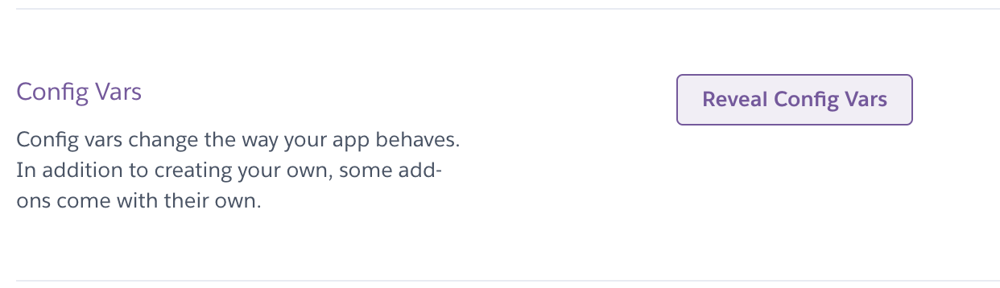
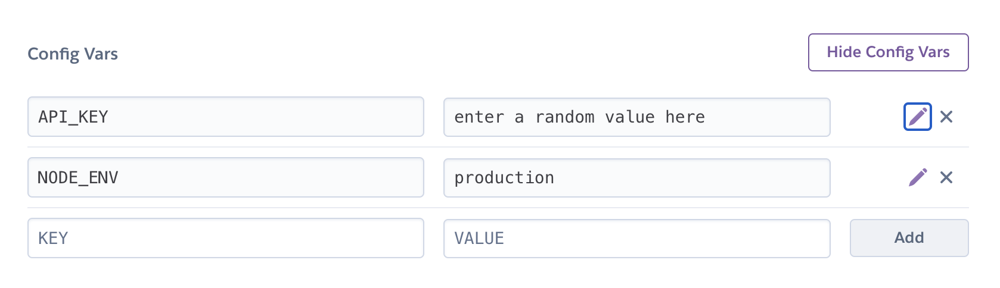

# Book Catalogue API

## Prerequisites

In order to use the API you will require the following:

1. Install [Git](https://git-scm.com/)
2. Install [NodeJS LTS](https://nodejs.org/en/) with npm **(It must be the LTS version.)**
3. Create a [Heroku](https://www.heroku.com/) account (free)

## Instructions

Follow the below instructions to get your API setup and ready for use.

1. Clone the repository to your computer
2. Run `npm install` in the root of the cloned repository
3. Ensure you have the [Heroku CLI Installed](https://devcenter.heroku.com/articles/heroku-cli#download-and-install) by
   running `heroku --version` in your terminal app
4. Run the following commands (In the project root directory):
    * Remove the cloned repository: `git remote remove origin`
    * Create a new Heroku App: `heroku create <choose-a-name-for-your-app>`
        * e.g. `heroku create noroff-assignment-api`
        * **Please note:** The name chosen must be unique on the `.herokuapp.com` domain
    * Push the files to your heroku app: `git push heroku master`
5. The app will be automatically deployed and started.
6. Check the terminal for your API's Url.

## API Key and Authorization Header

Lastly, on your [Heroku Dashboard](https://dashboard.heroku.com), open your API application, find the settings tab and
look for the Config Vars section

#### Locate the "Reveal Config Vars" button and click it



#### **Enter TWO config vars:**

```bash
NODE_ENV : production
API_KEY : any randomly generated string (64 characters)
```

See the screenshot below.



## Accessing Endpoints

The API endpoints has both open and protected endpoints. All `GET` endpoints are open. Any other method `POST`, `PUT`
, `PATCH` and `DELETE` is protected with the `X-API-KEY` header.

## Open Endpoints

Open endpoints do not require authentication.

### Book Catalogue Users `GET /users`

Get all the users from the API

#### Sample code

```javascript
const apiURL = 'your-api-url-goes-here'
const username = 'mega-mind'

fetch(`${ apiURL }/users`)
    .then(response => response.json())
    .then(users => {
        // results will be an array of all the users
    })
    .catch(error => {
    })
```

#### Sample Response

```json
[
  {
    "id": 1,
    "username": "dewaldels"
  }
]
```

### Catalogue Users `GET /users?username=<query>`

You can filter results to get a specific user from the API. It uses the standard URL Query String syntax.

> **e.g.** Search for a user with username `mega-mind` you can make a `GET` request to `apiUrl/users?username=mega-mind`.
>
> This will return an array of **all users** that match the username of mega-mind.

#### Sample Code

```javascript
const apiURL = 'your-api-url-goes-here'
const username = 'mega-mind'

fetch(`${ apiURL }/users?username=${ username }`)
    .then(response => response.json())
    .then(results => {
        // results will be an array of users that match the username of mega-mind.
    })
    .catch(error => {
    })
```

### Get books by userId `/books?userId=<userId>`

Fetch an array of books based on a userId.

#### Sample code
```javascript
const apiUrl = 'your-heroku-url-here'

async function getBooksByUserId(userId) {
    try {
        const books = await fetch(`${ apiUrl }?userId=${ userId }`).then(r => r.json())
        return [ null, books ]
    } catch (error) {
        return [ error.message, [] ]
    }

} 
```

## Protected Endpoints

Protected endpoints require the X-API-Key header with the API key as value.

### 🔒 Catalogue Users `POST /users`

Create a new user.

#### Sample Code

```javascript
const apiURL = 'your-api-url-goes-here'
const apiKey = 'your-public-api-key-goes-here'

async function createUser(username) {
    try {
        const user = await fetch(`${ apiURL }/users`, {
            method: 'POST',
            headers: {
                'x-api-key': apiKey,
                'content-type': 'application/json'
            },
            body: JSON.stringify({ username })
        }).then(response => {
            if (!response.ok) {
                throw new Error('Could not create new user')
            }
            return response.json()
        })

        return [ null, user ]
    } catch (error) {
        return [ error.message, null ]
    }
}
```

#### Sample response

```json
{
  "id": 2,
  "username": "book-master"
}
```

### 🔒 Catalogue Books `POST /books`

Create a new book

#### Sample Code

```javascript
const apiURL = 'your-api-url-goes-here'
const apiKey = 'your-public-api-key-goes-here'
const userId = 'user-id-goes-here'

const book = {
    title: "Hitchiker's Guide to the Galaxy",
    author: "Douglas Adams",
    cover_url: "https://images-na.ssl-images-amazon.com/images/I/91TpAAdiBLL.jpg",
    userId
}

async function createBook(book) {
    try {
        const createdBook = await fetch(`${ apiURL }/books`, {
            method: 'POST',
            headers: {
                'x-api-key': apiKey,
                'content-type': 'application/json'
            },
            body: JSON.stringify(book)
        }).then(response => {
            if (!response.ok) {
                throw new Error('Could not create new book')
            }
            return response.json()
        })
       
       return [ null, createdBook ]
    } catch (error) {
        return [ error.message, null ]
    }
}

```

#### Sample response

```json
{
   "id": 2,
   "title": "Hitchiker's Guide to the Galaxy",
   "author": "Douglas Adams",
   "cover_url": "https://images-na.ssl-images-amazon.com/images/I/91TpAAdiBLL.jpg",
   "userId": 1
}
```

### 🔒 Books `PATCH /books`

The `PATCH` method is used to update a single record

#### Sample Code

```javascript
const apiURL = 'your-api-url-goes-here'
const apiKey = 'your-public-api-key-goes-here'
const bookId = 1 // Update book with id 1

fetch(`${ apiURL }/books/${ bookId }`, {
    method: 'PATCH', // NB: Set method to PATCH
    headers: {
        'x-api-key': apiKey,
        'content-type': 'application/json'
    },
    body: JSON.stringify({
        // Provide new highScore to add to book with id 1
        cover_url: "new-cover-url-here"
    })
})
    .then(response => {
        if (!response.ok) {
            throw new Error('Could not update book')
        }
        return response.json()
    })
    .then(updatedBook => {
        // updatedBook is the book with the Patched data
    })
    .catch(error => {
    })
```

# Special thanks to Typicode for json-server

[Github: json-server](https://github.com/typicode/json-server)